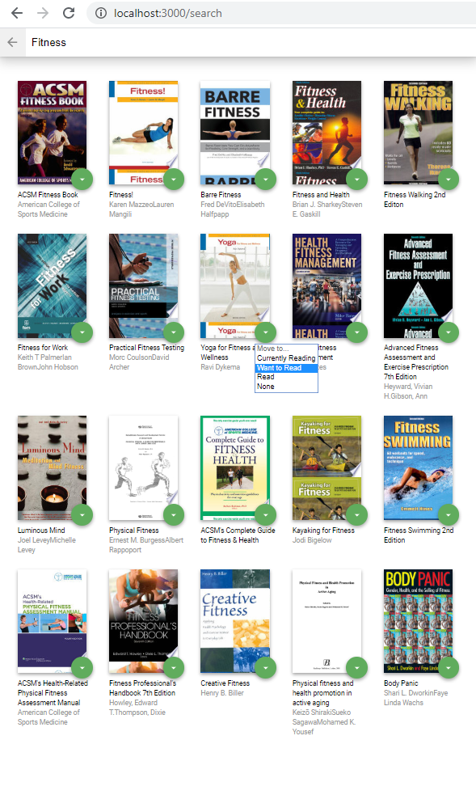

# MyReads Project

The MyReads project is a bookshelf application that allows you to select and categorize book you have read, are currently reading, or want to read. The main page displays a list of "shelves" (i.e categories), each of which contain a number of books. The three shelves are:
- Currently Reading
- Want to Read
- Read

Each book has a control that lets you select the shelf for that book. When you select a different shelf, the book moves there. The default value for the control is the current shelf the book is in.

The main page has a link to a search page that allows you to find books to add to your library (the home page). The search page has a text input that can be used to find books. As the value of the text input changes, the books that match that query are displayed on the page, along with a control that lets you add the book to your library. If a book is already in your library and returns in the search the control default will be the shelf the book is on. 

The search page also has a link which leads back to the main page. When you navigate back to the main page from the search page, you will see all of the selections you made on the search page in your library.

## How to start the application

To get start the MyReads app:

* navigate to the directory of the project
* install all project dependencies with the `npm install` command
* start the development server with the `npm start` command

When you start the server your default web browser should open a new tab to the local address `http://localhost:3000/`

