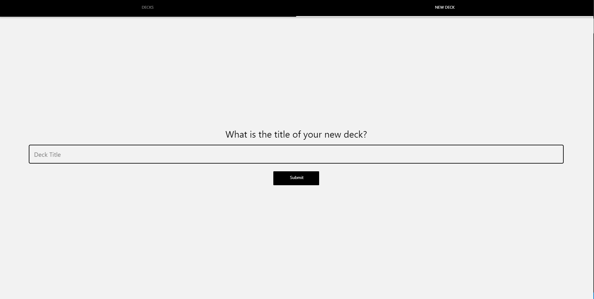

### Installation and startup instructions 
#### `npm install`

This will install all of the project's dependencies from npm

#### `expo start`

Runs the app in the development mode using [expo.io](https://expo.io/). 
Once expo is running you can choose to run the app for iOS or Androis. This app was built with Android in mind so it may not work or be visually appealing in iOS.

### Flashcards App
This is a Flashcards app that allows you to:
- Create a new deck
- Add Questions and Answers as a flashcard to the deck
- View the decks of flashcards you have created
- Take a quiz on a deck that will show you how many you got correct

#### Create a new Deck
To create a new deck navigate to the New Deck tab and add a title for the deck

#### Home Page
To view all of the decks you have created visit the Decks tab

#### Add a Flashcard to a deck
To add a falshcard to a deck, click on the deck, then click the Add Card button

#### Start the Quiz
To start a quiz for a deck click the `Start Quiz` button on the deck details page

