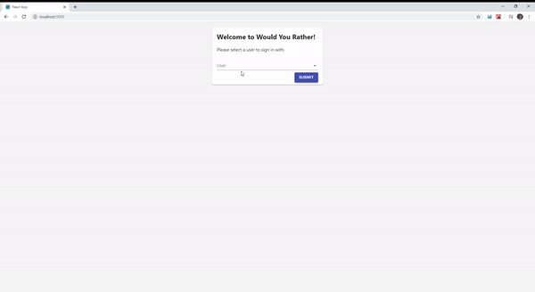

This is a Would-you-rather app that allows you to:
- Select a user to authenticate and enter the app with (Sign in page)
- Create new would-you-rather questions (New Questions page)
- See what questions have and havent been answered by you (whatever user you choose to enter the app with) (Home page)
- Answer questions and see the stats for the question such as how many votes were cast for each option and what percentage of the votes each option has (Questions/qid page)

### `npm install`

This will install all of the project's dependencies from npm

### `npm start`

Runs the app in the development mode. 
Open [http://localhost:3000](http://localhost:3000) to view it in the browser.

